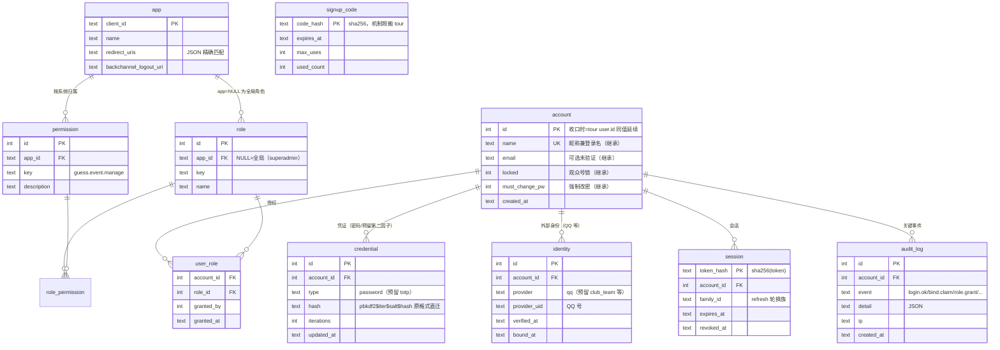
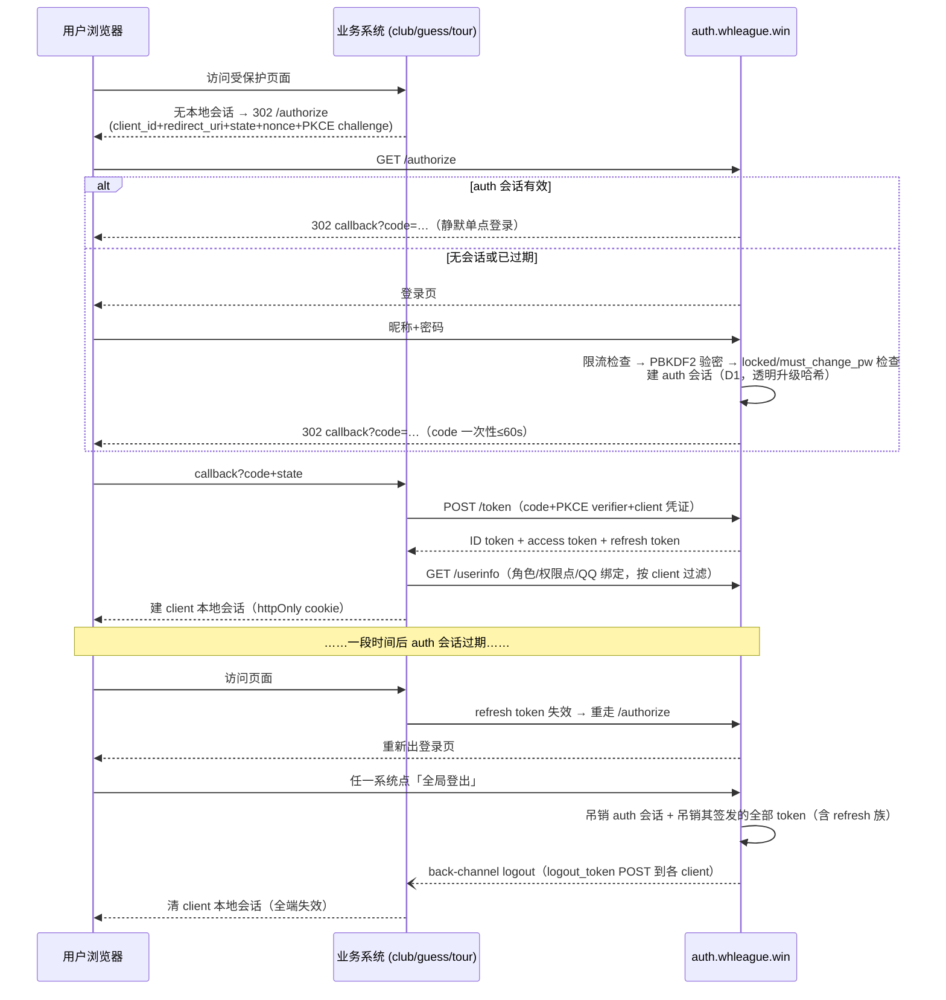

# WHL 统一认证系统（auth.whleague.win）· 技术方案

> 版本：v1.0（2026-09-12） · 状态：待开发
> 配套文档：[PRD.md](./PRD.md)（功能清单、优先级、验收标准、决策记录）
> 阅读提示：术语人话解释见 PRD §2。本方案为迁移项目设计——每个阶段都有回滚路径，不是只画 happy path。

## 1. 推荐方案（结论先行）

**auth.whleague.win = 自建 OIDC/OAuth2 授权中心**（纯 Workers + D1），成为账号 / 凭证 / 外部身份（QQ）/ 会话 / 权限点的唯一真源；三个系统作为标准 OIDC client 接入。迁移走三步桥：

| 步骤 | 动作 | 三系统代价 | 回滚 |
|------|------|-----------|------|
| ① 接管 | auth 按现有格式签发共享会话（`whl_session` cookie + KV `sess:{token}`） | **零改动**即全部接入，全局登出即刻生效 | auth 下线即可，tour 登录页未动 |
| ② 切换 | 逐系统把「信任共享 cookie」换成 OIDC：club → guess → tour | 每系统一次改造，各带 compat 回滚开关 | 开关拨回共享 cookie 模式 |
| ③ 收口 | 账号真源一次性 tour → auth，共享 KV/cookie 退役 | tour 彻底降级为 client | 迁移校验不过不切读；72h 回写窗口 |

否决项：CF Access（机制不适配，§3）；共享 Cookie+JWT 终态（只能当过渡桥，即步骤①）。

## 2. 现状盘点（2026-09-12 实测，含代码证据）

### 2.1 三系统

| | tour（赛事平台） | guess（竞猜） | club（俱乐部） |
|---|---|---|---|
| 部署 | 纯 Worker（Hono+React19），`tour.whleague.win` | 纯 Worker（2026-09-09 从 Pages 迁来），`guess.whleague.win` | 纯 Worker（Hono+React19），**未上线**，D1 id 为占位符 |
| 账号真源 | D1 `whl` user 表（8 字段：name 昵称即登录名 / email 可选未验证 / password_hash PBKDF2-25000 / role coach·admin·superadmin / locked / must_change_pw） | 无自有账号：登录验密、注册 INSERT、改密 UPDATE、邀请码核销**全部直写 tour 库**（TOUR_DB 绑定同一 D1 id） | 无登录/注册/登出：读共享 cookie+KV 透传 tour 登录态 |
| 会话 | KV `sess:{token}`（32B 随机）+ cookie `whl_session`（HttpOnly/Lax/7d，可选 `COOKIE_DOMAIN=.whleague.win`） | 双通道：A. 读主域 `whl_session`→共享 KV（**同一 namespace id**）→镜像本地；B. 本地 `whl_sess` 30 天（token 哈希存本地 sessions 表） | 只读共享 KV，自己不种 cookie、无登出 |
| 注册 | 邀请码（sha256，`signup_code` 表）/ 开放注册产 locked 观众号 / 首个用户=superadmin | 同 tour 机制（直写 tour 库） | 无 |
| QQ 绑定 | 无（`identity` 表占位零使用） | **已跑通**：网页 6 位一次性码（10min）→ QQ 群「绑定 <码>」→ 插件 HMAC 调 `/api/bind/claim` → `user_binding`（user_id、qq_id 双向唯一） | `qq_links` 表建了未实现（设计同竞猜思路） |
| 角色 | coach/admin/superadmin（`worker/middleware/auth.ts` requireAdmin/requireSuperadmin） | 映射 tour admin/superadmin→admin；本地 `initiators` 表（发起人可开盘/结算/发奖） | 映射：admin/superadmin→admin，coach→coach，locked→viewer |
| 积分 | — | 余额真源在 AstrBot 插件侧；本库只存发放凭证 `payout_item` + 流水镜像 `ledger_mirror` | — |

关键耦合事实：**共享 KV（id `87e2d783…`）被三个系统同时绑定**；guess 与 tour 直连同一个 D1（`whl`，id `ec3cc695…`）。这就是现状版 SSO——迁移起点极好，但任何一家的安全窟窿等于三家，这正是收口动机。

### 2.2 AstrBot 侧（5 个插件，路径 `C:\Users\bhdjb\whlPointSystem\AstrBot\data\plugins\`）

- **point_system（积分）**：SQLite `accounts(qq TEXT PRIMARY KEY)`——积分真源，主键是 QQ 号，不存赛事账号 id。绑定映射不在本地（真源在 guess.user_binding）。web 部分仅 HMAC 鉴权的机器 API（`/sync/credit`、`/sync/summary`，经 CF Tunnel 暴露 `astrbot.whleague.win`），**无网页**。
- **growth（成长）**：唯一带网页的插件——AstrBot Dashboard 扩展端点 + 控制台，靠 Dashboard 登录态保护、无端点级权限 → P2 收口对象。
- **negotiation（谈判）**：自带「QQ→球队」本地绑定表 + 认证码（自带防爆破）→ P2 收口对象，将来由 identity 链推导。
- **elo / revenue**：QQ 或 club 维度，无绑定逻辑。
- 插件与竞猜的互信：HMAC-SHA256 请求签名（`X-Timestamp`/`X-Sign`，±300s 防重放，常数时间比较），共享密钥 SYNC_SECRET。

### 2.3 对方案影响最大的结论

1. auth 可以做「兼容会话签发者」：按现有格式写 KV + 种主域 cookie，三系统零改动即接入（步骤①的可行性依据）。
2. QQ 绑定不用发明新流程：竞猜的「一次性码 + 群指令 + HMAC 回调 + 双向唯一」就是防冒充的现成答案。
3. 密码哈希（PBKDF2，格式 `pbkdf2$25000$salt_b64$hash_b64`）可直接迁移，auth 照抄验密逻辑即可，登录时可透明升级参数。
4. guess 对 tour 库的直写（注册/改密/邀请码核销）是迁移清单里最重的一项。
5. 全生态用户资料 = 昵称 + 邮箱，「资料收编」收益趋近于零（见 §11）。

## 3. 认证协议选型（任务书问题 1）

| 方案 | 结论 | 理由（两句话内） | 代价 |
|------|------|------------------|------|
| **自建 OIDC Provider** | ✅ 终态 | 标准授权码+PKCE，client 只信自己的本地会话；AstrBot web、未来任何系统按标准接入；单点登出/刷新有标准做法。 | auth 实现 authorize/token/userinfo/jwks 等端点；每 client 写一次接入层 |
| 共享主域 Cookie+JWT | ⚠️ 仅作过渡桥（步骤①） | 迁移起点好，但终态绑死 `.whleague.win` 子域、无标准登出/刷新、非网页端难接。 | 过渡期 auth 短期耦合旧格式，收口后删除 |
| CF Access | ❌ 永久排除 | 它是「门禁」不是「身份中心」：登录走邮箱验证码或企业 IdP（用户是 QQ 系、邮箱大半为空），按座位计费（免费 50 席，超出 $3/人/月且按全座位计），拿不到 QQ 绑定/权限点等应用内语义。 | — |

**OIDC 实现选型**：核心端点自写（端点少、逻辑可控、便于安全审计）+ [`jose`](https://github.com/panva/jose) 做 JWT 签名（Workers 兼容）。官方 [workers-oauth-provider](https://github.com/cloudflare/workers-oauth-provider)（OAuth 2.1+PKCE）作参考实现；[Neil Madden 的安全批评](https://neilmadden.blog/2025/06/06/a-look-at-cloudflares-ai-coded-oauth-library/)逐项核对后决定是否复用其代码——质量优先，倾向自写核心并做一轮独立安全评审。

**端点清单**：

| 端点 | 说明 |
|------|------|
| `GET /authorize` | 校验 client 与 redirect_uri（精确匹配）、PKCE challenge 必带；auth 会话有效则直接发 code（静默单点登录），否则出登录页 |
| `POST /token` | code（一次性、≤60s、绑定 client+redirect_uri+challenge）+ code_verifier + client 认证 → 发 ID token（RS256, 10min）/ access token（30min）/ refresh token（轮换，≤7d 对齐 auth 会话） |
| `GET /userinfo` | Bearer access token → `sub / name / locked / must_change_pw / roles / permissions`（按 token aud 过滤该 app 的，避免跨系统泄漏）`/ qq`（绑定身份） |
| `GET /.well-known/openid-configuration`、`/jwks.json` | 发现与验签公钥（私钥存 Worker Secret，`kid` 支持轮换） |
| `POST /revoke` | 吊销 access/refresh token |
| `GET/POST /logout` | 吊销 auth 会话 + 该会话签发的全部 token；back-channel POST 各 client `backchannel_logout_uri`（logout_token JWT） |
| `POST /api/admin/*`（增量 8，12 条） | 管理能力机器端点，**POST-only + HMAC 验签**（与球队绑定共用 `machineGate`，密钥 `BIND_SECRET`，契约 `X-Sign = hex(HMAC-SHA256(secret,"POST\|path\|ts\|raw"))`）：`accounts/list`、`accounts/detail`、`catalog`、`accounts/roles`、`accounts/grants`、`accounts/password`、`accounts/unlock`、`accounts/disable`、`sessions/revoke`、`org-settings`、`signup-codes/create`、`signup-codes/list`。调用方是 tour 管理台（`worker/lib/authAdmin.ts`）；操作者身份由 tour 会话决定后作 `actor_id` 传入，auth 侧只认 HMAC 不认人（鉴权由调用方的权限点 `tour.accounts.manage` / `tour.org.settings` 负责），操作结果由 auth 记审计、tour 另记一份本地审计 |

## 4. 部署形态（任务书问题 6）——结论：纯 Workers + Static Assets

事实核查：

1. **生态已全员纯 Worker**：tour/club 生来就是 Worker；guess 2026-09-09 刚从 Pages 迁到 Worker（`wrangler.jsonc` main + assets + `run_worker_first: ["/api/*"]`）。
2. **官方口径**：[迁移指南](https://developers.cloudflare.com/workers/static-assets/migrate-from-pages/)明说 Workers「功能面明显更广」（渐进部署、Cron Triggers、完整可观测性）、**静态资产请求免费**、`_headers`/`_redirects`/SPA fallback（`not_found_handling: "single-page-application"`）原生支持。
3. **auth 的具体需求**全部命中 Workers 强项：`run_worker_first` 保护 `/api/*`（三系统已验证的模式）、中间件自由组合（Hono）、后续可加 Durable Objects/Cron。
4. **配额与定价**：≤50 用户下免费档请求/存储余量充足；静态请求免费。Workers Paid（$5/月）唯一实质收益是 CPU 上限（10ms → 默认 30s，[已核实](https://developers.cloudflare.com/workers/platform/limits/#cpu-time)），可把密码哈希迭代数从 25k 提到 300k+，列为可选加固。

代价：无实质代价。唯一注意点：Workers 不会像 Pages 那样自动推断 SPA 行为，需显式配置（三系统已是这么做的）；`.assetsignore` 需手动配置。**建议：纯 Workers，与生态一致。**

## 5. 中央账号模型（任务书问题 2）

### 5.1 ER 草图（终态）



### 5.2 建表草案（D1，实现时可微调）

```sql
CREATE TABLE account (
  id INTEGER PRIMARY KEY,              -- 收口时 = tour user.id 同值延续，三系统业务外键零改动
  name TEXT NOT NULL UNIQUE,           -- 昵称兼登录名（继承）
  email TEXT,                          -- 可选、未验证（继承）
  locked INTEGER NOT NULL DEFAULT 0,
  must_change_pw INTEGER NOT NULL DEFAULT 0,
  created_at TEXT NOT NULL
);

CREATE TABLE credential (
  id INTEGER PRIMARY KEY,
  account_id INTEGER NOT NULL REFERENCES account(id),
  type TEXT NOT NULL DEFAULT 'password',   -- 预留 'totp'（P2 2FA）
  hash TEXT NOT NULL,                      -- pbkdf2$iter$salt_b64$hash_b64（与 tour 格式一致）
  iterations INTEGER NOT NULL,
  updated_at TEXT NOT NULL
);

CREATE TABLE identity (
  id INTEGER PRIMARY KEY,
  account_id INTEGER NOT NULL REFERENCES account(id),
  provider TEXT NOT NULL,                  -- 'qq'（预留 'club_team' 等）
  provider_uid TEXT NOT NULL,
  verified_at TEXT,
  bound_at TEXT NOT NULL,
  UNIQUE (provider, provider_uid)          -- 一个 QQ 只能绑一个账号
);
CREATE UNIQUE INDEX idx_identity_acct_provider ON identity(account_id, provider);
-- 双向唯一：一个账号在每个 provider 下也只有一个身份（吸收 guess user_binding 约束）

CREATE TABLE session (
  token_hash TEXT PRIMARY KEY,             -- sha256(token)，token 本身不落库
  account_id INTEGER NOT NULL REFERENCES account(id),
  family_id TEXT NOT NULL,                 -- refresh 轮换族：重用检测→吊销整族
  created_at TEXT NOT NULL,
  expires_at TEXT NOT NULL,
  last_seen_at TEXT,
  revoked_at TEXT
);

CREATE TABLE app (
  client_id TEXT PRIMARY KEY,
  name TEXT NOT NULL,
  redirect_uris TEXT NOT NULL,             -- JSON 数组，精确匹配
  backchannel_logout_uri TEXT NOT NULL,
  created_at TEXT NOT NULL
);

CREATE TABLE permission (
  id INTEGER PRIMARY KEY,
  app_id TEXT NOT NULL REFERENCES app(client_id),
  key TEXT NOT NULL,
  description TEXT,
  UNIQUE (app_id, key)
);

CREATE TABLE role (
  id INTEGER PRIMARY KEY,
  app_id TEXT REFERENCES app(client_id),   -- NULL = 全局角色（superadmin）
  key TEXT NOT NULL,
  name TEXT NOT NULL,
  UNIQUE (app_id, key)
);

CREATE TABLE role_permission (
  role_id INTEGER NOT NULL REFERENCES role(id),
  permission_id INTEGER NOT NULL REFERENCES permission(id),
  PRIMARY KEY (role_id, permission_id)
);

CREATE TABLE user_role (
  account_id INTEGER NOT NULL REFERENCES account(id),
  role_id INTEGER NOT NULL REFERENCES role(id),
  granted_by INTEGER,
  granted_at TEXT NOT NULL,
  PRIMARY KEY (account_id, role_id)
);

CREATE TABLE signup_code (                 -- 机制照搬 tour（sha256 存储、过期、次数）
  code_hash TEXT PRIMARY KEY,
  expires_at TEXT NOT NULL,
  max_uses INTEGER,                        -- NULL = 不限次
  used_count INTEGER NOT NULL DEFAULT 0,
  created_by INTEGER,
  created_at TEXT NOT NULL
);

CREATE TABLE audit_log (
  id INTEGER PRIMARY KEY,
  account_id INTEGER,
  event TEXT NOT NULL,                     -- login.ok/login.fail/bind.claim/bind.unbind/role.grant/session.revoke/...
  detail TEXT,
  ip TEXT,
  created_at TEXT NOT NULL
);
```

增量 7 落地补记（0008 迁移 `migrations/0008_team_binding.sql`，实现与草案一致处以迁移为准）：新增 `team`（`tour_team_id`/`club_id` 均唯一可空的目录）、`team_bind_code`（中央码表：`code_hash` 唯一、`via` 记发码入口、`used_by` 记烧码账号）、`team_binding`（PK(account_id,team_id) + UNIQUE(account_id) 一账号一队）。机器端点（`src/routes/machine.ts`，与既有 `/api/bind/claim` 共用 machineGate 限流+验签，X-Sign = hex(HMAC-SHA256(BIND_SECRET, "POST|path|ts|raw"))，±300s）：`POST /api/team/bindcode`（team_id/tour_team_id/club_id 恰一，ttl 1–720h，明码只回一次）、`POST /api/team/bind`（烧码+一账号一队前置，单事务原子）、`POST /api/team/unbind`、`POST /api/team/register`（目录登记 upsert）、`POST /api/team/link`（补 club_id 关联）。

### 5.3 过渡期与终态的差异（重要）
| | 过渡期（步骤①②） | 终态（步骤③后） |
|---|---|---|
| 账号真源 | **tour 库 user 表**（auth 直连读写，同 guess 现状模式） | auth 库 `account`/`credential`；tour user 表只读归档 |
| auth 绑定 | TOUR_DB（读写 user/signup_code）+ 共享 KV（写 `sess:*`）+ auth D1（identity/permission/audit 已启用） | 仅 auth D1 + 自己的限流 KV |
| 会话 | auth 会话写 D1 `session`（OIDC 用）+ 兼容键写共享 KV（老 client 用） | 仅 D1；共享 KV 绑定移除 |
| ID | account.id = tour user.id 同值 | 新用户继续沿用同一序列 |

要点（**增量 7 改判，推翻本节最初裁定**）：最初裁定「球队不进 auth 的 identity——球队绑定是业务资源关系，留在 club 库」。但 tour 与 club 各有一套球队认证互不相通，裁决把**球队绑定关系上收 auth 成为唯一真源**：0008 迁移新增 `team`（tour team ↔ club club 的目录，`tour_team_id`/`club_id` 均唯一可空）、`team_bind_code`（中央码表，tour/club 双入口发码写同一张表）、`team_binding`（UNIQUE(account_id) 一账号一队，一队可多账号）；机器端点五条 HMAC（`/api/team/bindcode|bind|unbind|register|link`，密钥共用 BIND_SECRET）。tour/club 双侧发码/烧码界面保留，写同一张 auth 中央表（烧码在 auth 单事务原子）；两侧旧码表/绑定表（tour `auth_code`/`team_member`、club `club_bind_code`/`club_bindings`）休眠保留防回滚，代码不再读写；两侧经只读 `AUTH_DB` D1 绑定派生读（`SELECT t.tour_team_id/club_id FROM team_binding b JOIN team t ON t.id=b.team_id WHERE b.account_id=?`）。存量迁移：`scripts/migrate-team-bindings.mjs` 以 tour `team_member` 为基准全量迁 `team_binding`，目录按队名精确匹配建行（撞名不自动关联），club 绑定做校对、冲突/单边出报告人工裁决。谈判插件的「QQ→球队」将来由 `identity(qq) → account → team_binding → team` 链推导。

增量 8 落地补记（0009 迁移 `migrations/0009_admin.sql`）：新增 `account_permission`（账号级「额外授予」权限点，PK(account_id, permission_id)，主键索引即覆盖按 account_id 查询）、`account.disabled_at`（停用时间戳，NULL = 正常；**`locked` 语义不动**，它只挡绑队/提交阵容不挡登录）、`session.ip`（登录来源 IP，`createSession` 时写入）。权限下发随之改为两种来源的并集：`oidc.ts permissionsFor` 一条 UNION SQL = 角色派生（含全局角色）∪ 账号级授予（按 `p.app_id = aud` 收紧，不跨系统泄漏），仍只有 userinfo 一个调用点。userinfo/id_token claims 新增 `disabled`；被停用账号在 `/userinfo` 下发空 roles/permissions、`/token` 换码与刷新一律 `invalid_grant`，会话中间件把 `disabled_at` 与吊销/过期同列一道闸。会话新增 `last_seen_at` 埋点（全站热路径，**节流 5 分钟**才写库）；`revokeOneSessionAndNotify` / 账号级批量吊销 / back-channel 通知改为「一条 SQL 批量 + 各 client 地址一次查全」。

**赛事平台降级改造点**：登录/注册页跳 auth；`attachUser` 中间件从「读 KV+查 user 表」改为 OIDC 会话校验；`/api/auth/*` 退役；admin 账号管理职能迁 auth 管理台（P1）；`team_member`/`signup_code` 等业务表不动（tour D1 仍是业务真源；绑定真源随增量 7 上收 auth，`team_member` 随迁移休眠）。

## 6. 权限点模型（任务书问题 4）

三层：**权限点**（per-app 枚举）→ **角色**（权限点集合，含全局角色）→ **授权**（账号×角色）。client 从 userinfo 拿到按 app 过滤的角色+权限点，判定改 `requirePermission(key)`。

### 6.1 权限点目录（首发，行为等价播种）

| app | 权限点 | 对应现状判定（位置） |
|-----|--------|---------------------|
| tour | `tour.match.manage` | requireAdmin（录入员职能，`worker/middleware/auth.ts:16`） |
| tour | `tour.team.bindcode.issue` | admin 生成球队认证码（`routes/admin.ts:88`） |
| tour | `tour.accounts.manage` | requireSuperadmin（账号管理，`routes/admin/accounts.ts:8`） |
| tour | `tour.org.settings` | 开放注册开关（超管，`routes/admin.ts:31`） |
| tour | `tour.team.bind` | coach 绑队（`routes/coach.ts:16`） |
| guess | `guess.event.manage` | requireManager（开盘/结算/发奖，`src/_lib/auth.ts:170`） |
| guess | `guess.users.manage` | 账号列表/发起人设置（仅 admin，`src/api.ts:541`） |
| guess | `guess.payout.reverse` | 冲正（`src/api.ts:919`） |
| guess | `guess.recon.view` | 对账（`src/api.ts:944`） |
| club | `club.clubs.manage` | 建队/列表（`src/worker/routes/admin.ts:27`） |
| club | `club.bindings.unbind` | 解绑（`admin.ts:151`） |
| club | `club.players.import` | 球员导入（`admin.ts`） |
| club | `club.ledger.manage` | 账本/期初导入 |
| club | `club.registrations.manage` | 报名审核 |
| club | `club.compliance.view` | 合规查看 |
| club | `club.squad.manage` | 教练排阵（requireCoach） |
| club | `club.registrations.submit` | 教练提交报名 |

### 6.2 播种映射（迁移脚本逻辑，上线第一天判定与今天完全一致）

| 现有来源 | 换算结果 |
|----------|----------|
| tour `user.role='superadmin'` | 全局角色 `superadmin`（持有全部权限点） |
| tour `user.role='admin'` | `tour.recorder`（match.manage + bindcode.issue）+ `guess.admin` + `club.admin` |
| tour `user.role='coach'` | `tour.coach`（team.bind）+ `club.coach` |
| guess `initiators` 表各行 | `guess.initiator`（event.manage） |
| guess admin 专属权限 | `guess.admin` = event.manage + users.manage + payout.reverse + recon.view |
| locked 状态 | 不进授权——是账号状态，client 端保留「locked→viewer」映射 |

### 6.3 下发方式

userinfo 按 access token 的 `aud` 只返回**该 client 的**角色与权限点 + 全局角色，避免跨系统信息泄漏；token 体积可控（≤50 用户、每 app 权限点 <20 个）。

## 7. QQ 绑定管理（任务书问题 3）

### 7.1 流程

- **绑定**：登录 auth → 绑定页生成 6 位一次性码（10 分钟、一码一用）→ 用户在 QQ 群发「绑定 <码>」→ 插件 HMAC 签名调 `POST auth/api/bind/claim {code, qq_id}` → 校验后写 `identity(provider='qq')` → 回执 `{ok, displayName}`。
- **解绑**：QQ 群发「/解绑」→ 插件验证发起者 QQ 当前有绑定 → 调 `POST auth/api/identity/unbind {qq_id}`（HMAC）→ 删 identity。auth 页面发起的解绑（P1）需 QQ 侧确认指令，防页面被他人操作。
- **解绑确认码（增量 11 落地，PRD P1-4）**：绑定页点「解绑此 QQ」→ 生成 6 位一次性解绑确认码（复用 `bind_code` 表，0011 迁移加 `kind` 列区分 `'bind'`/`'unbind'`，10 分钟）→ 用户在绑定 QQ 的群发「解绑 <码>」→ 插件调 `POST auth/api/identity/unbind/confirm {code, qq_id}`（HMAC）→ 三重校验（码有效、该 QQ 确有绑定、码归属账号与绑定账号一致）→ 删 identity + 核销码 + 审计同 batch。两类码互相不可串用（查询带 kind 条件）；群里无码「解绑」老路保留。审计 `bind.unbind` 的 `detail.via` 区分 `qq_direct` / `web_confirm`。
- **换绑** = 解绑 + 重新绑定，同两条流程串联。
- **积分影响**：积分真源在插件侧、主键 QQ 号，解绑/换绑只解除「QQ↔账号」关联，积分余额不动（写进用户提示）。

### 7.2 防冒充（四重校验）

1. 码只出现在**已登录**的 auth 绑定页（证明账号持有）；
2. 「绑定 <码>」必须由该 QQ 号发出（插件从消息发送者取 qq_id，证明 QQ 持有）；
3. 插件→auth 全程 HMAC-SHA256 签名 + 时间戳防重放；
4. `identity` 双向唯一约束 + 绑定码限速（沿用插件 `sync_bind_cooldown`）。

### 7.3 一个 QQ 被绑到多个账号

`identity UNIQUE(provider, provider_uid)` 直接拒绝，错误码 `qq_bound`（沿用竞猜现有文案语义）；反向 `idx_identity_acct_provider` 保证一个账号在每个 provider 下只有一个身份。

### 7.4 插件契约变更（改动最小化）

- 配置新增 `bind_claim_url`（默认空 = 沿用 `sync_base_url`）与 `bind_secret`（**独立密钥，不复用 SYNC_SECRET**——职责分离，泄漏面隔离）。
- claim 请求/响应形状与竞猜现有契约**完全一致**（`{code, qq_id}` → `{ok, displayName}` / `invalid_code` / `qq_bound` / `user_bound`），插件改动量约 50 行（handlers/sync.py + 配置 schema）。
- 新增「/解绑」指令处理。战报轮询（`/api/reports/pending|ack`）与积分同步（`/sync/credit|summary`）**不动**——那是竞猜的业务契约。
- 数据迁移：guess `user_binding` 一次性迁入 `auth.identity`（步骤②切 guess 时执行）；guess 运行时改从 userinfo 拿 QQ 绑定（发奖需要 qq_id），本地绑定表退役。

## 8. 安全清单（逐项，写进验收）

| # | 项 | 方案 |
|---|-----|------|
| 1 | **密码哈希** | PBKDF2-SHA256 原格式直迁（25000 迭代，验密零阻力、常数时间比较）；登录成功透明重哈希升级迭代数。约束：Free 档 CPU 上限 10ms/请求（[已核实](https://developers.cloudflare.com/workers/platform/limits/#cpu-time)），25k→50k 需本地压测确认；开 Paid 可上 300k+（可选加固）。管理员重置密码流程沿用（临时密码 + must_change_pw）。**现状（2026-09-18，增量 9）：透明重哈希已实现**——登录成功后台把低迭代存量哈希升到当前档（`src/routes/pages.ts`，waitUntil 不挡响应；legacy 账号一次性 +1 写，审计 `pw.rehash`）；迭代数决策见 §12 假设 5，保持 25k |
| 2 | **会话固定** | 登录成功必发 256bit 新随机 token，不复用任何登录前值；OIDC code 一次性、≤60s、绑定 client+redirect_uri+PKCE challenge |
| 3 | **CSRF** | client 侧 state+nonce（httpOnly cookie 存储校验）+ PKCE 强制；auth 表单 POST 带 CSRF token；cookie 延续 SameSite=Lax；redirect_uri 精确匹配 |
| 4 | **防暴力破解** | 沿用 KV 固定窗口限流模式（登录 IP 10/15min + 账号 5/15min；注册 IP 5/h；绑定码限速）；命中写 audit_log；auth 用自己的 KV namespace，键前缀与现有 `rl:` 约定隔离 |
| 5 | **QQ 绑定防冒充** | §7.2 四重校验（页码 + QQ 消息 + HMAC + 双向唯一） |
| 6 | **token 过期刷新** | refresh token 轮换（一次性，重用检测 → 吊销整族 `family_id`）；auth 会话 7 天（对齐现状，可配）；client 本地会话有效期 ≤ auth 会话；access token 30min |
| 7 | **登出传播** | OIDC 侧吊销即时（D1 强一致）；back-channel logout 通知各 client。兼容期 KV 键删除为最终一致——旧值最长可见至 cache TTL（[CF FAQ](https://developers.cloudflare.com/kv/reference/faq/)，未给默认秒数；**按 60 秒上限评估，标假设**），三系统每次请求都查 KV，故最坏 60 秒后全端失效，可接受并写入验收说明 |
| 8 | **审计** | login.ok/fail、bind.claim/unbind、role.grant/revoke、session.revoke、pw.change 全量入 audit_log（含 IP）；observability 开启。**覆盖现状（2026-09-18）**：上述全部分类均已落地——原有 login.ok/login.fail/login.rate_limited/register.ok/register.rate_limited/logout/pw.change/bind.claim/bind.unbind/oidc.code_replay/oidc.refresh_reuse/team.* ；增量 8 补 role.grant、role.revoke、perm.grant、perm.revoke、session.revoke、pw.reset、account.disable、account.enable、account.unlock、signup_code.create、org.open_reg。管理端点的业务写入与审计**同一次 DB.batch**（`auditStatement`），杜绝「业务已改但审计缺失」；tour 侧对同一动作另记一份本地 audit_log（`target_type='account'`，带 actor_user_id），双写在增量 7 球队绑定上已有先例 |

## 9. 迁移与灰度（任务书问题 5）

### 9.1 三阶段

| 阶段 | 动作 | 三系统状态 | 前置条件 |
|------|------|-----------|----------|
| **P0 准备** | auth Worker 骨架 + D1 `whl-auth` + 权限目录播种（不上线、不接流量） | 无感知 | — |
| **① 接管** | auth 上线登录/注册页（读写 tour 库），签发兼容 KV 会话 + 种主域 cookie | **零改动**；全局登出生效（删 KV 键 + D1 吊销） | tour 配 `COOKIE_DOMAIN=.whleague.win`（现状已可配） |
| **② 切 client** | 1. **club**：首次部署即 OIDC（试点，验证全链路）→ 2. **guess**：登录/注册入口指 auth、直写 tour 库代码下线、本地 30 天会话退役、user_binding 迁 auth.identity、插件改 bind_claim_url → 3. **tour**：登录页跳 auth、attachUser 改造 | 每系统一个 compat 开关（环境变量） | ①已稳定运行 |
| **③ 收口** | user → account 一次性迁移 + 校验脚本；tour user 表转只读；auth 管理台（P1）接管账号管理；共享 KV 停写，旧会话 7 天自然过期；guess/tour 移除 TOUR_DB user 读写与共享 KV 绑定 | tour 彻底降级 | 校验全绿 + 管理台就绪 |

**③ 收口现状（2026-09-18，增量 9 更新）**：账号迁移（`scripts/migrate-accounts.mjs` + `verify-accounts.mjs`）、共享 KV 停写、auth 不再绑定 TOUR_DB 均已完成；**管理能力于增量 8 补齐**（12 条机器端点 + tour 管理台改道）；**增量 9 残留清理已做**——tour/guess 的 register/password 直写 user 表死码已删（兼容模式一律 410），tour `user` 表自此代码零写入（只读，表保留）；guess 登录路径镜像写入退役、五个读点改实时查 auth（§5.2 guess user_binding 闭环）。仍保留（有意，非遗漏）：tour/guess 的 compat 登录只读分支（有测试覆盖的回滚通道）、guess `TOUR_DB` 绑定（compat 登录仍只读引用）、guess 本地 30 天会话表（随 compat 登录保留）。**compat 开关已显式化**：三 RP 的 `isOidc()` 改判 `AUTH_MODE === "oidc"`（+连接变量齐备），`AUTH_MODE: "oidc"` 写死在各自 wrangler.jsonc `[vars]` 随部署走——TECH_DESIGN §7 表格里「compat 开关（环境变量）」的承诺就此兑现，不再靠 OIDC_ISSUER 有无隐式判定。

### 9.2 双登录态说明
①②期间 auth 登录页与 tour 登录页**并存**：同一账号两边登录都有效（同一会话格式、同一张 user 表），注册双入口写同一张表（决策 #4）。这正是过渡期的意义——用户无感知，系统逐个换引擎。

### 9.3 回滚 runbook

> **2026-09-18 改判（重要）**：①共享 KV 兼容桥自 2026-09-14 四系统全量切 OIDC 后**已停写**（`src/lib/session.ts` 顶部注释），旧 `sess:{token}` 条目随 7 天 TTL 自然归零（约 2026-09-21），**不存在「拨回共享 cookie 模式即恢复」的通道**；②TECH_DESIGN 初稿里的 R3 回写脚本（auth account → tour user）**从未实现**，`scripts/` 下没有该脚本。因此下述 R1 保留、R2 与 R3 已失效，改为「只回滚数据与开关，不回滚登录态」。

| 场景 | 操作 | 用户影响 |
|------|------|----------|
| R1：①阶段 auth 异常 | auth 域名路由下线 | 无（tour 登录页未动过） |
| R2：**已失效**（原「某 client 切换后拨回共享 cookie 模式」） | 该通道的两根支柱都已不存在：auth 侧不再写共享 KV，client 侧 compat 分支只剩代码未删。现状下 client 出问题的处置是**回滚该 client 的部署版本**（OIDC 变量一起回退），代价是该系统用户按旧登录页重新登录一次 | — |
| R3：**已失效**（原「收口后 72h 内异常 → 恢复 tour user 表写权限 + 回写脚本」） | 回写脚本不存在，写权限恢复也无对象。现状下账号数据出问题的处置是**从 D1 时间点快照/备份恢复 auth 库**，或按 `audit_log` 逐条重放管理动作 | — |
| 管理动作回滚（增量 8 起） | 管理台每个写动作在 auth 与 tour **双侧都有审计**（谁、何时、对谁改了什么），误操作按审计记录手工反向执行 | 轻微 |

数据安全声明：迁移全程只做「复制 + 只读化」，无破坏性变更；三系统业务库自持不受影响。

### 9.4 部署清单（实操项）

1. DNS/域名：auth.whleague.win Worker 自定义域；club.whleague.win。
2. CF 盾：auth 域名**不启** Browser 挑战（否则 authorize 跳转被拦截）；确认 tour 现有盾对浏览器透明（探测发现 tour 有质询页，浏览器应正常，需实测）。
3. Secrets：`AUTH_JWT_PRIVATE_KEY`（RS256，`kid` 支持轮换）、`AUTH_BIND_SECRET`（插件用，独立于 guess 的 SYNC_SECRET）、CSRF/cookie 密钥。
4. D1：建 `whl-auth` 库 + migrations；KV：auth 自建 namespace（限流），兼容期额外绑定共享 KV（写 `sess:*`，收口后移除）。
5. observability + alarm（错误率/限流命中）。

## 10. 登录全流程时序图（含未登录跳转 / callback / 会话过期 / 全局登出）



## 11. 「个人资料统一收编 auth」影响分析（开放议题，供拍板）

**现状事实**：全生态用户资料 = 昵称（兼登录名）+ 可选未验证不可改的邮箱；无头像；三个系统都没有资料编辑页；AstrBot 侧 QQ 昵称不落任何系统库。

**好处**：① 未来统一门户/个人中心一处展示；② AstrBot web、未来新系统直接从 OIDC `profile` scope 取资料，不重复建表；③ 将来上头像/签名时只有一个权威口子，数据一致性有保证。

**坏处**：① auth 从纯安全件变成业务数据持有方——备份、隐私、审计面变大，安全评审范围扩大；② 昵称兼登录名，收编后「改昵称」牵出登录名/显示名拆分的隐藏工作量（涉及三系统展示处全改）；③ 当前资料趋近于零、无编辑入口，现实收益≈0；唯一受益方（门户页）本身是 P2。

**技术侧建议**：**本期不收编**。理由：auth 保持窄面（安全件最小攻击面原则）；数据模型已按可扩展设计（将来加 `profile` 表或 account 扩展列 + OIDC `profile` scope，迁移无阻力）；等门户页（P2）立项时一并评估更有依据。**待需求方拍板，本方案不默认收编。**

## 12. 假设与待核清单

| # | 假设/待核 | 影响 | 状态 |
|---|-----------|------|------|
| 1 | KV 旧值最长可见至 cache TTL，按 60 秒上限评估（CF FAQ 未给默认秒数） | 兼容期全局登出传播延迟 | 标假设，落地复核 cacheTTL 参数文档 |
| 2 | tour.whleague.win 的 CF 质询页对浏览器用户透明，且 auth 域名可不启挑战 | OIDC 跳转链路 | 部署清单项，上线前实测 |
| 3 | club 域名按 club.whleague.win 规划 | 首次部署 | 已与需求方确认未上线 |
| 4 | `jose` 在 Workers 的 RS256 签名性能满足 ≤50 用户量级 | token 签发 | 社区通行实践，未单独压测 |
| 5 | PBKDF2 25k→50k 迭代在 Free 档 10ms CPU 内可行 | 哈希升级幅度 | **已压测证伪（2026-09-18，增量 9）**：`scripts/bench-pbkdf2.mjs` 原生 WebCrypto 实测 25k 中位 10.0ms / 50k 中位 18.0ms（近线性翻倍），25k 已贴 Free 档 10ms CPU 上限，50k 必超。决策：保持 25k，存量一致性交给登录成功透明重哈希；上 Paid（CPU 上限放宽）再议提档 |
| 6 | 插件生产配置（sync_secret 实值等）只在腾讯云服务器，本机为开发副本 | 插件改造部署 | 探查确认，部署时注意 |

## 13. 来源

- [Pages→Workers 官方迁移指南](https://developers.cloudflare.com/workers/static-assets/migrate-from-pages/)（部署形态事实）
- [Workers 限额：CPU 时间](https://developers.cloudflare.com/workers/platform/limits/#cpu-time)（Free 10ms / Paid 默认 30s）
- [Workers KV FAQ：最终一致性](https://developers.cloudflare.com/kv/reference/faq/)（登出传播延迟口径）
- [Zero Trust 定价（Access $3/人/月）](https://blog.cloudflare.com/teams-plans/) 与 [社区对 50 席免费/全座位计费的确认](https://community.cloudflare.com/t/cloudflare-zero-trust-cost/693419/)（CF Access 排除依据）
- [cloudflare/workers-oauth-provider](https://github.com/cloudflare/workers-oauth-provider) 与 [Neil Madden 安全分析](https://neilmadden.blog/2025/06/06/a-look-at-cloudflares-ai-coded-oauth-library/)（OIDC 实现参考）
- [Cloudflare OAuth 服务端实践博客](https://blog.cloudflare.com/oauth-2-0-authentication-server/)（可行性参考）
- 三系统与 AstrBot 插件仓库实地探查（文件级证据见 §2 各处标注）
